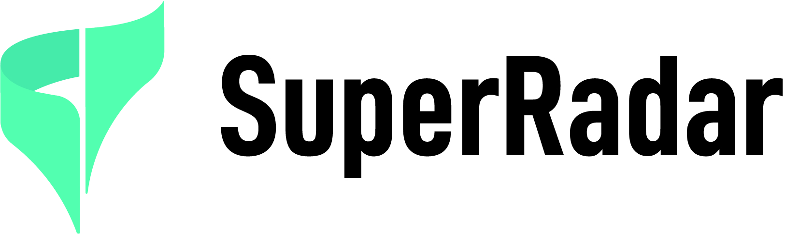

<div align="center">
<a href='https://www.superradar.cn'>
</img>
</a>


[](https://github.com/Super-Radar/CTSAI-A100/blob/main/LICENSE)


</div>

# CTSAI-A100 开源毫米波雷达

CTSAI-A100 是 SuperRadar 社区面向科研单位、算法团队与技术开发者开放的毫米波感知硬件。它支持点云数据输出与 ADC 数据采集，适用于毫米波雷达信号处理、点云算法开发、目标检测、轨迹分析、多传感器融合、机器人感知、低空感知与交通场景数据采集等研究方向。

本仓库提供 CTSAI-A100 的上位机工具、驱动程序、ADC 数据采集说明、Python 可视化示例、Matlab ADC 分析示例、示例数据与基础文档，帮助用户快速完成从硬件连接到数据采集和算法验证的完整流程。


## SuperRadar 社区介绍

SuperRadar 是由承泰科技发起并长期支持的开放毫米波感知技术社区，聚焦毫米波雷达、AI 感知、多传感器融合、机器人、低空经济、智能交通、工业安全与高校科研等方向。

社区希望通过开放硬件、开放数据、开发工具、技术文档、示例工程与真实场景实践，降低毫米波雷达技术的研究与应用门槛，帮助开发者和研究团队更快进入毫米波感知的底层数据链路，推动更多感知应用共创。


### 核心能力

* **ADC 数据采集**：支持采集雷达底层 ADC 数据，便于开展 FFT、滤波、目标检测、微多普勒分析和信号处理算法研究。
* **点云数据输出**：支持查看和采集雷达点云数据，可用于点云聚类、目标跟踪、轨迹分析和场景理解。
* **RadarTools 上位机**：支持设备连接、目标显示、远波 / 近波切换、点云采集、点云回放和 ADC 数据采集。
* **Python 可视化示例**：提供雷达数据读取、点云显示、聚类显示、轨迹绘制等基础示例。
* **Matlab ADC 分析示例**：提供 ADC 数据读取、配置文件加载和基础信号处理流程参考。
* **下线标定支持**：提供基础标定流程，便于校准雷达安装角度与实验平台坐标。

### 适用方向

* 毫米波雷达信号处理
* 点云算法开发
* 目标检测与目标跟踪
* 多传感器融合研究
* 机器人环境感知
* 低空目标感知
* 智能交通与道路场景采集
* 高校教学与科研实验
* 场景数据采集与模型验证


## 快速入门

首次使用 CTSAI-A100 社区版，请按以下步骤完成环境准备、设备连接、数据采集与示例验证：

1. **阅读快速开始文档**
   请先参阅 [CTSAI-A100 快速开始文档](./docs/quick-start.md)，了解硬件连接、软件工具、数据采集和示例运行的完整流程。

2. **安装 USB-CAN FD 驱动**
   按照 [CTSAI-A100 驱动安装文档](./docs/driver-installation.md) 安装 USB-CAN FD 驱动，并在 Windows 设备管理器中确认设备已正常识别。

3. **连接 CTSAI-A100 硬件**
   完成雷达供电、CAN-H / CAN-L 接线，并将 USB-CAN FD 盒连接至电脑。接线方式和注意事项请参阅 [CTSAI-A100 快速开始文档](./docs/quick-start.md)。

4. **启动 RadarTools 上位机**
   按照 [RadarTools 上位机使用文档](./docs/radartools-guide.md) 启动 `RadarTools_V1.4.6.3.exe`，完成设备配置后点击 `Start`，查看原始点、跟踪点、目标距离、速度和角度等数据。

5. **切换远波 / 近波模式**
   如需进行不同距离范围的实验，可在 RadarTools 中切换远波或近波模式。具体操作请参阅 [RadarTools 上位机使用文档](./docs/radartools-guide.md)。

6. **采集点云数据**
   在 RadarTools 中完成点云采集与回放，采集后的 `.asc` 文件可用于点云分析、目标检测、轨迹分析和算法验证。详细流程请参阅 [RadarTools 上位机使用文档](./docs/radartools-guide.md)。

7. **采集 ADC 原始数据**
   如需开展雷达信号处理、FFT、滤波、目标检测或微多普勒分析，请按照 [CTSAI-A100 ADC 数据采集文档](./docs/adc-capture.md) 采集 ADC 数据。

8. **运行 Python 雷达可视化示例**
   使用 [Python 雷达可视化示例](./docs/python-visualization.md) 读取示例 CSV 数据，完成点云显示、目标筛选、聚类显示和轨迹绘制。

9. **使用示例数据验证工具链**
   仓库提供 [示例 ADC 数据](./sample-data/adc/)、[点云示例数据](./sample-data/pointcloud/) 和 [Python 可视化示例数据](./sample-data/visualization/)，便于用户在接入真实硬件前验证数据处理流程。

10. **进行雷达下线标定**
    如需校准雷达安装角度与实验平台坐标，请参阅 [CTSAI-A100 下线标定文档](./docs/calibration.md)，完成标定目标布置、工具启动、标定执行和结果检查。

完成以上步骤后，即可基于 [examples](./examples/) 目录中的示例工程，开展毫米波雷达信号处理、点云算法、目标检测、轨迹分析、多传感器融合与场景数据采集等研究工作。


## 需要帮助？

使用过程中遇到问题，可以通过以下方式获取支持：

### 加入 SuperRadar 社群

欢迎加入 SuperRadar 开发者社群，与社区成员、科研团队和算法开发者交流：

* 硬件连接与上位机使用
* ADC 数据采集与处理
* 点云数据分析
* Python / Matlab 示例运行
* 雷达信号处理算法
* 多传感器融合与场景应用

### 提交 GitHub Issue

如果你发现文档问题、工具异常、示例代码错误或数据格式问题，请在 GitHub 提交 Issue。

提交 Issue 时，请尽量包含以下信息：

* 使用的硬件版本
* 使用的工具版本
* 操作系统版本
* 问题复现步骤
* 报错截图或日志
* 相关数据文件示例

---

## 如何贡献

欢迎开发者、研究者和社区成员参与 CTSAI-A100 文档、示例代码和数据集共建。

你可以贡献：

* 文档修正和补充
* 示例代码优化
* Python / Matlab 数据处理脚本
* ADC 数据处理方法
* 点云算法示例
* 典型场景数据
* 可视化工具
* Bug 修复
* 使用案例和研究笔记

贡献流程：

1. Fork 本仓库
2. 创建新的分支
3. 提交修改
4. 发起 Pull Request
5. 等待社区 review 与合并

分支命名示例：

```bash
git checkout -b docs/update-adc-guide
git checkout -b examples/add-python-tracking-demo
```

提交信息示例：

```bash
git commit -m "docs: update ADC capture guide"
git commit -m "examples: add Python tracking visualization demo"
```

---

## 许可证 License

本仓库中的文档、示例代码、示例数据和工具资源可能适用不同许可证。具体以各目录下的 `LICENSE` 或说明文件为准。

建议目录说明如下：

| 内容            | License                 |
| ------------- | ----------------------- |
| 文档            | CC BY 4.0               |
| 示例代码          | Apache-2.0              |
| 示例数据          | CC BY-NC 4.0            |
| RadarTools 工具 | 由承泰科技 / SuperRadar 授权使用 |

使用本仓库中的工具、数据和示例代码前，请阅读对应目录下的许可证和使用说明。

---

## 免责声明

CTSAI-A100 相关工具、示例代码和数据仅用于研究、开发、教学和实验验证。不同实验环境下的实际效果可能受到目标类型、安装方式、供电条件、通信链路、波形配置、算法参数和测试环境影响。

ADC 数据、点云数据、示例脚本和分析结果仅作为研究与开发参考，不构成对特定应用效果的保证。

---

## 相关链接

* SuperRadar 官网：`https://superradar.cn`
* SuperRadar GitHub：`https://github.com/SuperRadar`
* 问题反馈：`https://github.com/SuperRadar/ctsai-a100/issues`
* 社区讨论：`https://github.com/SuperRadar/ctsai-a100/discussions`
